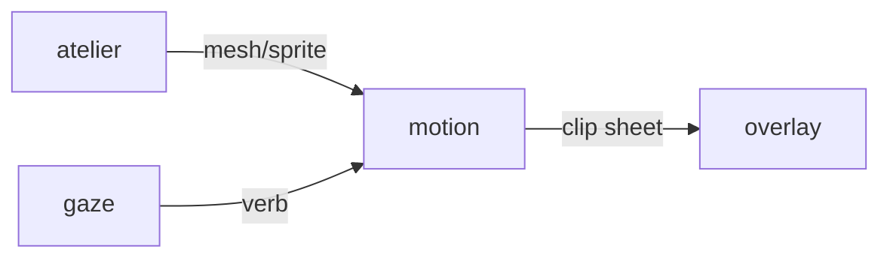

# Motion

**Procedural Animator** — A planned animation tool for baking pet movement into sprite sheets and timing data.

Part of [ComputerPets](https://github.com/RicheyWorks/computerpets). Map: [computerpets-ecosystem](https://github.com/RicheyWorks/computerpets-ecosystem).

[Status](#status) · [Contract](docs/CONTRACT.md) · [Contributor start](#contributor-start) · [Ecosystem](https://github.com/RicheyWorks/computerpets-ecosystem)

| Project | At a glance |
| --- | --- |
| Status | Design scaffold; not runnable yet |
| License | MIT |
| First pet | [Flagship start guide](https://github.com/RicheyWorks/computerpets/blob/main/docs/START-HERE.md) |

## Status

This repository contains a [contract](docs/CONTRACT.md) and a [source placeholder](src/motion/__init__.py). It has no runnable application, build manifest, automated tests, or CI workflow.

The experience, interfaces, integrations, and safeguards below are **implementation plans**, not supported features. The first implementation slice defines the initial contribution target.

## Planned role

The overlay is a living sticker. Motion fills walk, sit, carry, eat, sleep, and sick cycles without a 10,000-frame hand-authored sheet per species.

For the desktop pet, start with the [flagship guide](https://github.com/RicheyWorks/computerpets/blob/main/docs/START-HERE.md).

## Intended audience

Desktop renderer, Agility, Cadence, Soar. Bake once, play many.

## Out of scope

Not a DCC tool. Not a place to T-pose on the live overlay.

## Proposed integration



## Planned stack

Python 3.12 · PyTorch · CUDA skeletal solver · sprite sheet exporter · gRPC clip server

GroupId / namespace: `com.enterprisepet.motion`  
Proposed listen surface: `8093`

## Proposed contract

### Data

`Rig(speciesId, bones[]) · Clip(verb, fps, frames, loop) · BakeJob(id, status)`

### Surface

- POST /v1/clip — {speciesId, verb, seed} → sprite sheet + json timings
- GET /v1/rig/{speciesId} — bone lengths, IK limits
- POST /v1/bake — overnight batch bake of the 210 default cycles

### Planned safeguards

CUDA absent → CPU bake, warn once. Impossible IK → snap to rest pose. Bake fail → keep last good clip, never a T-pose on the desktop.

## First implementation slice

Initial implementation target:

**Rui walk + sit clips at 12 fps, JSON timings targeting the Electron overlay format.**

Acceptance targets: CUDA missing: CPU bake, warn once. Bad IK: rest pose, never a T-pose on the desktop.

## Planned environment

`CUDA_VISIBLE_DEVICES`, `CLIP_OUT`

Never commit secrets. Never put Steam or chain keys in the overlay.

## Related projects

- [computerpets](https://github.com/RicheyWorks/computerpets) desktop renderer
- [computerpets-atelier](https://github.com/RicheyWorks/computerpets-atelier) (new trait meshes)
- [computerpets-gaze](https://github.com/RicheyWorks/computerpets-gaze) (gesture-driven clips)

## Layout

```
computerpets-motion/
  README.md           this file
  LICENSE             MIT
  docs/CONTRACT.md    the same contract, frozen for implementers
  src/                implementation lands here
```

## Contributor start

With Git and PowerShell, clone the scaffold and read its contract and source marker:

```powershell
git clone https://github.com/RicheyWorks/computerpets-motion.git
Set-Location computerpets-motion
Get-Content .\docs\CONTRACT.md
Get-Content .\src\motion\__init__.py
```

Start with the [first implementation slice](#first-implementation-slice). Add the minimum project setup and tests needed for that slice, then document verified run commands. The proposed stack above is a design choice; there is no install or launch command for this checkout yet.

## Links

- Flagship: [RicheyWorks/computerpets](https://github.com/RicheyWorks/computerpets)
- This repo: [RicheyWorks/computerpets-motion](https://github.com/RicheyWorks/computerpets-motion)
- Map: [RicheyWorks/computerpets-ecosystem](https://github.com/RicheyWorks/computerpets-ecosystem)
- Contract file: [docs/CONTRACT.md](docs/CONTRACT.md)

## License

MIT. See [LICENSE](LICENSE).

---

*Two hundred ten living kinds. Keep them so a line does not go quiet.*
