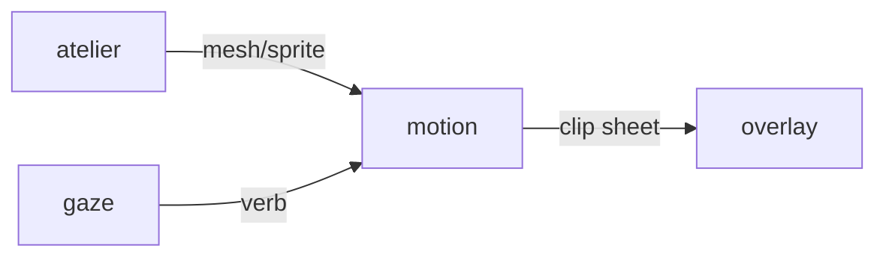

# Motion

**Procedural Animator** — GPU animation generator for fluid, dynamic pet movement on the desktop overlay.

Part of [ComputerPets](https://github.com/RicheyWorks/computerpets). Map: [computerpets-ecosystem](https://github.com/RicheyWorks/computerpets-ecosystem).

| | |
| --- | --- |
| Status | Design scaffold — contract frozen, implementation next |
| License | MIT |
| First pet | Still [Rui on the desktop](https://github.com/RicheyWorks/computerpets/blob/main/docs/START-HERE.md). This organ is optional. |

## The job

The overlay is a living sticker. Motion fills walk, sit, carry, eat, sleep, and sick cycles without a 10,000-frame hand-authored sheet per species.

The flagship overlay already puts a living sticker on the real desktop (Rui first, 210 kinds). Motion does not replace that. It is one organ.

## Who uses it

Desktop renderer, Agility, Cadence, Soar. Bake once, play many.

## What it is not

Not a DCC tool. Not a place to T-pose on the live overlay.

## Architecture



## Stack

Python 3.12 · PyTorch · CUDA skeletal solver · sprite sheet exporter · gRPC clip server

GroupId / namespace: `com.enterprisepet.motion`  
Default listen: `8093`

## Contract

### Data

`Rig(speciesId, bones[]) · Clip(verb, fps, frames, loop) · BakeJob(id, status)`

### Surface

- POST /v1/clip — {speciesId, verb, seed} → sprite sheet + json timings
- GET /v1/rig/{speciesId} — bone lengths, IK limits
- POST /v1/bake — overnight batch bake of the 210 default cycles

### Failure doctrine

CUDA absent → CPU bake, warn once. Impossible IK → snap to rest pose. Bake fail → keep last good clip, never a T-pose on the desktop.

## First slice

Build this and stop. Do not boil the ocean.

**Rui walk + sit clips at 12 fps, JSON timings the Electron overlay already understands.**

You know it works when: CUDA missing: CPU bake, warn once. Bad IK: rest pose, never a T-pose on the desktop.

## Environment

`CUDA_VISIBLE_DEVICES`, `CLIP_OUT`

Never commit secrets. Never put Steam or chain keys in the overlay.

## Neighbors

- computerpets desktop renderer
- computerpets-atelier (new trait meshes)
- computerpets-gaze (gesture-driven clips)

## Layout

```
computerpets-motion/
  README.md           this file
  LICENSE             MIT
  docs/CONTRACT.md    the same contract, frozen for implementers
  src/                implementation lands here
```

## Run (Windows)

PowerShell, from this folder, after the flagship helpers (Git, Node LTS 22+, JDK 21 as needed):

```powershell
python -m venv .venv; pip install -e .; python -m motion.bake --species rui
```

You do not need this service to meet Rui. The [flagship start-here](https://github.com/RicheyWorks/computerpets/blob/main/docs/START-HERE.md) is still the first pet.

## Links

- Flagship: [RicheyWorks/computerpets](https://github.com/RicheyWorks/computerpets)
- This repo: [RicheyWorks/computerpets-motion](https://github.com/RicheyWorks/computerpets-motion)
- Map: [RicheyWorks/computerpets-ecosystem](https://github.com/RicheyWorks/computerpets-ecosystem)
- Contract file: [docs/CONTRACT.md](docs/CONTRACT.md)

## License

MIT. See [LICENSE](LICENSE).

---

*Two hundred ten living kinds. Keep them so a line does not go quiet.*
